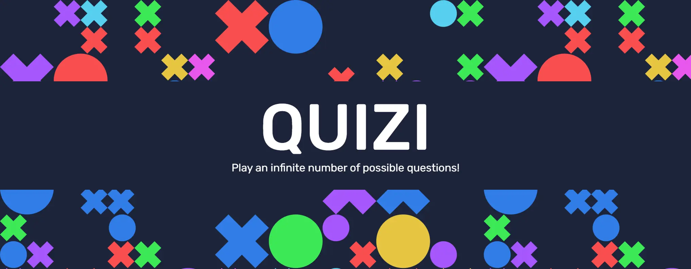
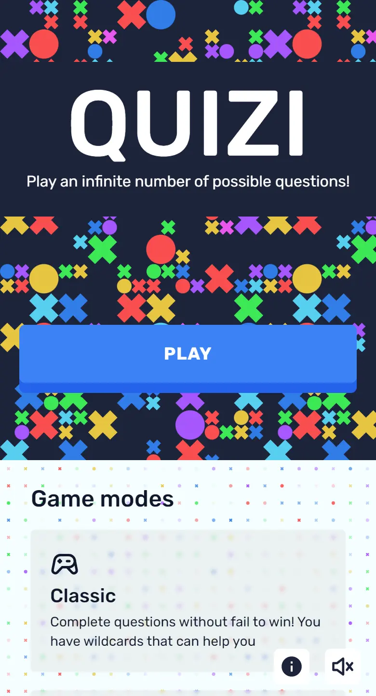
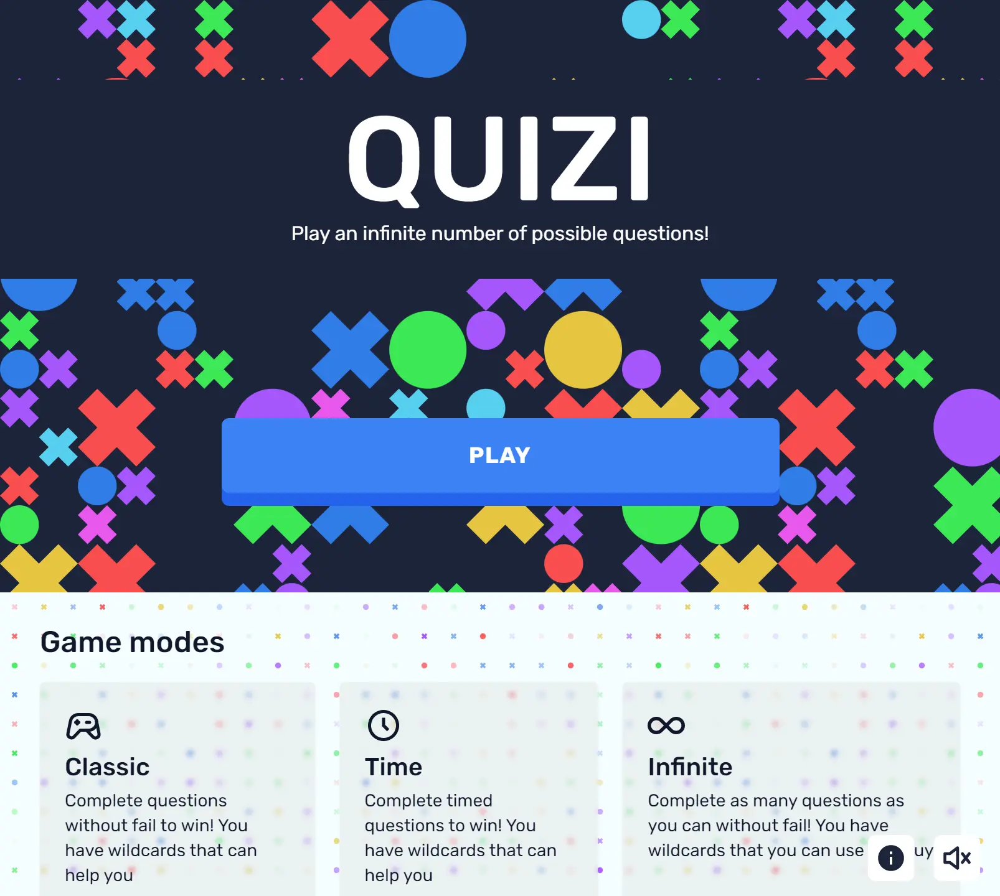
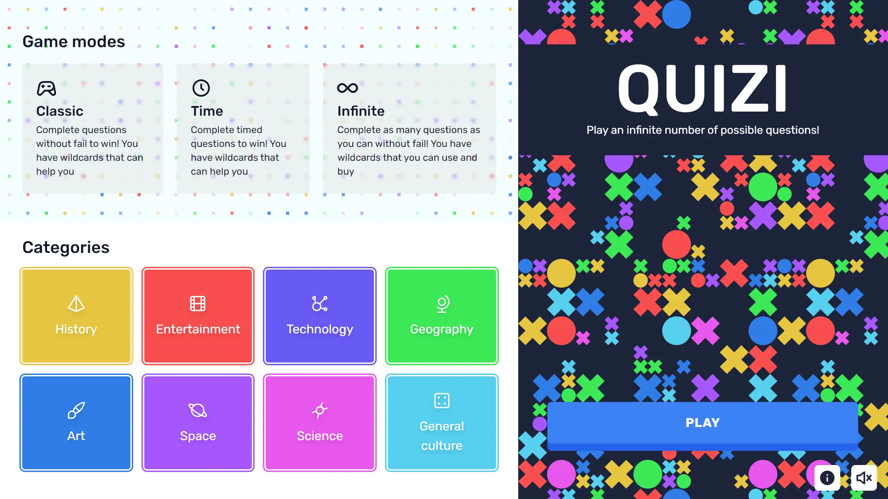
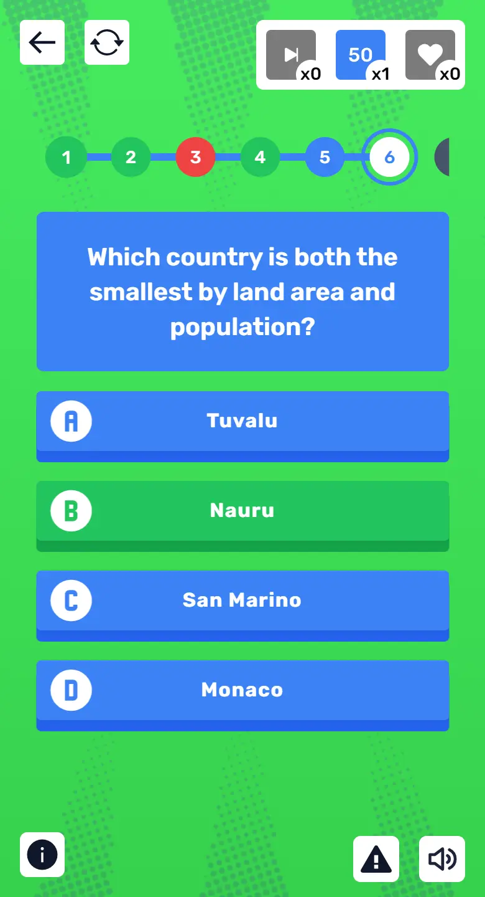
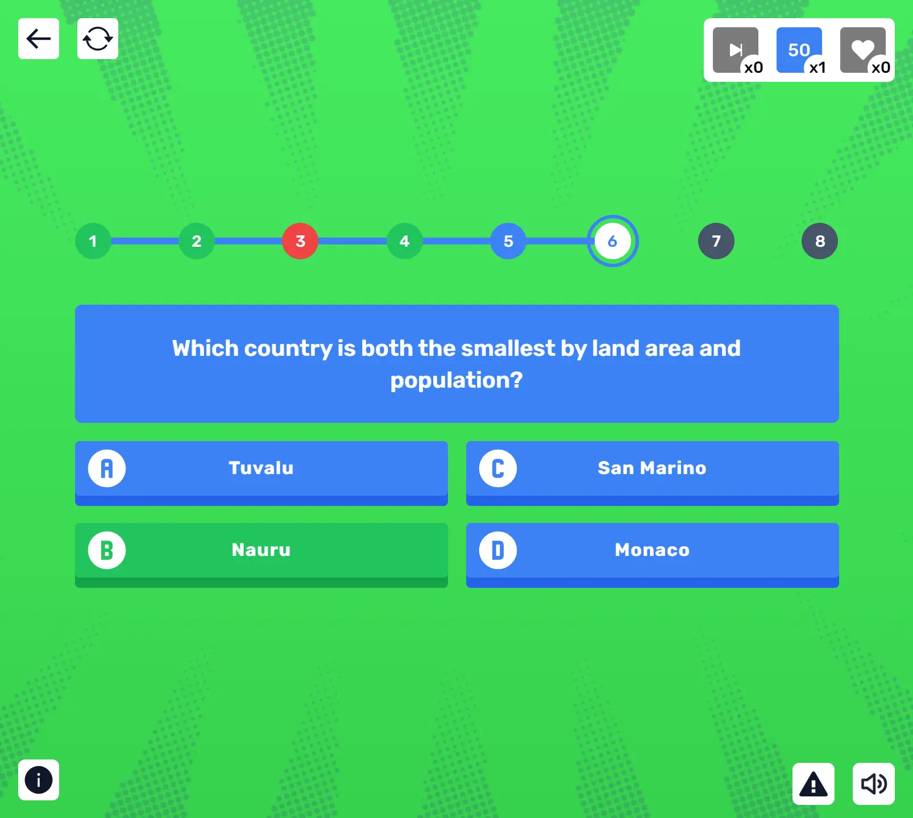
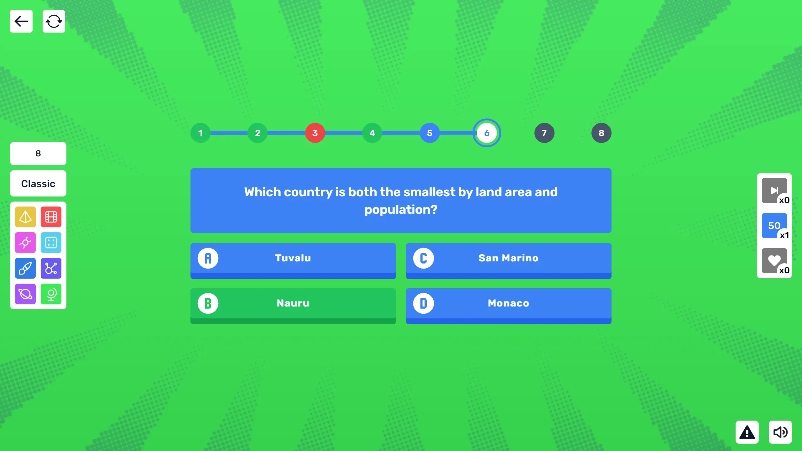
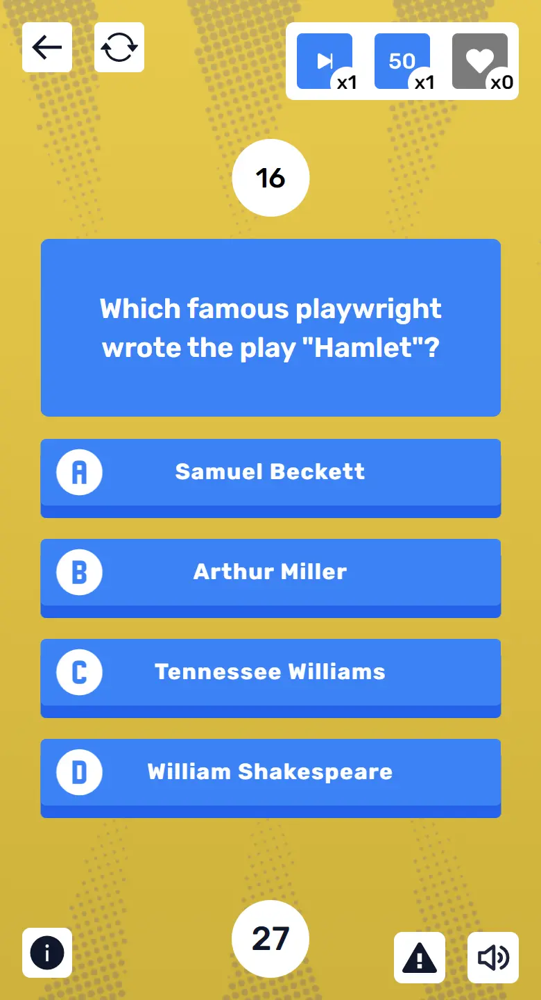
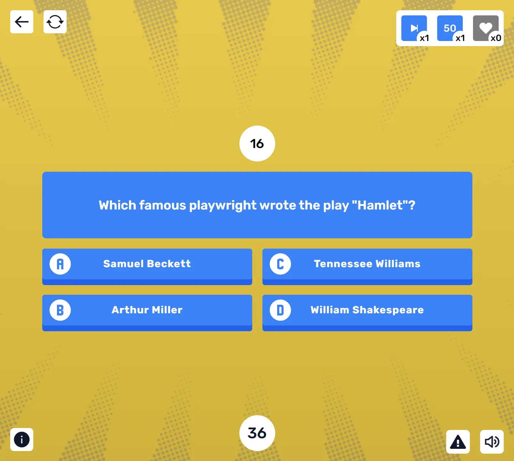
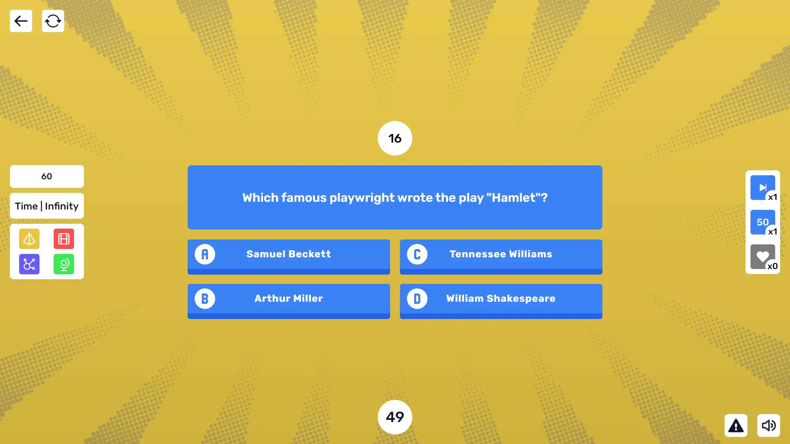

<div id="top"></div>

<!-- PROJECT LOGO -->
<div align="center">
<a href="https://aayush-anand.dev/quiz-lab"></a>
<br/>
<br />

  # 🟥🟦 Quiz Lab 🟨🟩

A portfolio-ready quiz experience designed and maintained by Aayush Anand. Select game modes, choose topics, and use wildcards for a polished trivia challenge that works offline and in modern browsers.

  <a href="https://aayush-anand.dev/quiz-lab">View Demo</a>
  ·
  <a href="https://github.com/aayush-anand/quiz-lab/issues">Report Bug</a>
  ·
  <a href="https://github.com/aayush-anand/quiz-lab/issues">Request Feature</a>
</div>


<!-- TABLE OF CONTENTS -->
<details>
<summary>Table of contents</summary>

- [About The Project](#about-the-project)
- [Screenshots](#screenshots)
- [Built With](#built-with)
- [Getting Started](#getting-started)
- [License](#license)
- [Roadmap](#roadmap)
- [Contact](#contact)
</details>

<!-- ABOUT THE PROJECT -->
## About The Project

Quiz Lab is a polished trivia experience created by Aayush Anand. It includes multiple game modes, curated categories, and wildcard assists for a flexible play style. The app supports local question playback, with optional AI-enhanced generation via Cohere when configured.

> **Note:** The project includes local fallback questions for reliable play during development and when API access is unavailable.

<p align="right"><a href="#top">⬆️ Back to top</a></p>


<!-- SCREENSHOTS -->
## Screenshots

<table>
    <tr>
      <td>
          
      </td>
      <td>
          
      </td>
      <td>
          
      </td>
    </tr>
        <tr>
      <td>
          
      </td>
      <td>
          
      </td>
      <td>
          
      </td>
    </tr>
    <tr>
      <td>
          
      </td>
      <td>
          
      </td>
      <td>
          
      </td>
    </tr>
</table>

<p align="right"><a href="#top">⬆️ Back to top</a></p>


### Built With

List of the frameworks, libraries and tools used to build the project.

* [Next.js](https://nextjs.org/)
* [React.js](https://reactjs.org/)
* [Zustand](https://github.com/pmndrs/zustand) For state management
* [Cohere](https://dashboard.cohere.ai/welcome/register) For the generation of questions
* [Vercel](https://vercel.com/) For hosting
* [Tailwind CSS](https://tailwindcss.com/) For styling
* [AnimatiSS](https://xsgames.co/animatiss/) For animations (title hover, correct and wrong answer)
* [Patternpad](https://patternpad.com/editor.html) For the home background pattern
* [Figma](https://www.figma.com/) For the design
* [React icons](https://react-icons.github.io/react-icons/) For icons
* [Iconify](https://iconify.design) For the answers letters icons
* [Tabler Icons](https://tablericons.com) For the categories icons
* [Canvas confetti](https://www.npmjs.com/package/canvas-confetti) For the confetti animation
* [Vector Halftone Maker](https://halftone.xoihazard.com) For the halftone effect

<p align="right"><a href="#top">⬆️ Back to top</a></p>


<!-- GETTING STARTED -->
## Getting Started

1. Clone or fork the repo
```sh
git clone https://github.com/aayush-anand/quiz-lab
```
2. Change directory to `source_code`
```sh
cd source_code
```
3. Install NPM packages
```sh
npm install
```
4. Run the project
```sh
npm run dev
```

The game includes pre-generated questions for development. To use AI-enhanced generation, create a `.env.local` file in `source_code` with your Cohere API key and enable the AI path in `src/helpers/getQuestions.js`.

The `.env.local` file should look like this:

```
COHERE_API_KEY=XXXXXXXXXXXXXXXXXX
```

<p align="right"><a href="#top">⬆️ Back to top</a></p>


<!-- LICENSE -->
## License

Distributed under the MIT License. See [`LICENCE`](./LICENCE) for more information.

<p align="right"><a href="#top">⬆️ Back to top</a></p>


<!-- ROADMAP -->
## Roadmap

- [ ] ~~Circle wipe transition~~
- [x] Add offline mode
- [x] Buttons sounds
- [x] Win and Lose sounds
- [ ] ~~Multi-language Support~~
- [ ] ~~PWA~~
- [x] Personalize the game over screen for infinite mode
- [ ] ~~Personalize error page for API limit exceeded~~

<p align="right"><a href="#top">⬆️ Back to top</a></p>

<!-- CONTACT -->
## Contact

Built and maintained by [Aayush Anand](https://aayush-anand.dev).

<p align="right"><a href="#top">⬆️ Back to top</a></p>
